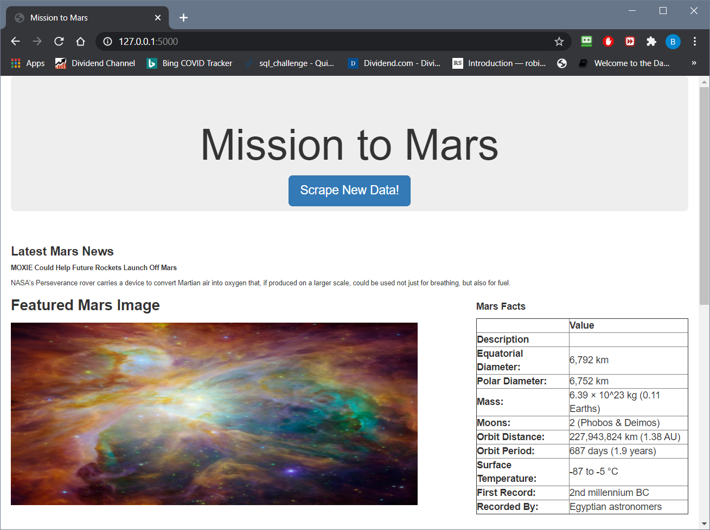
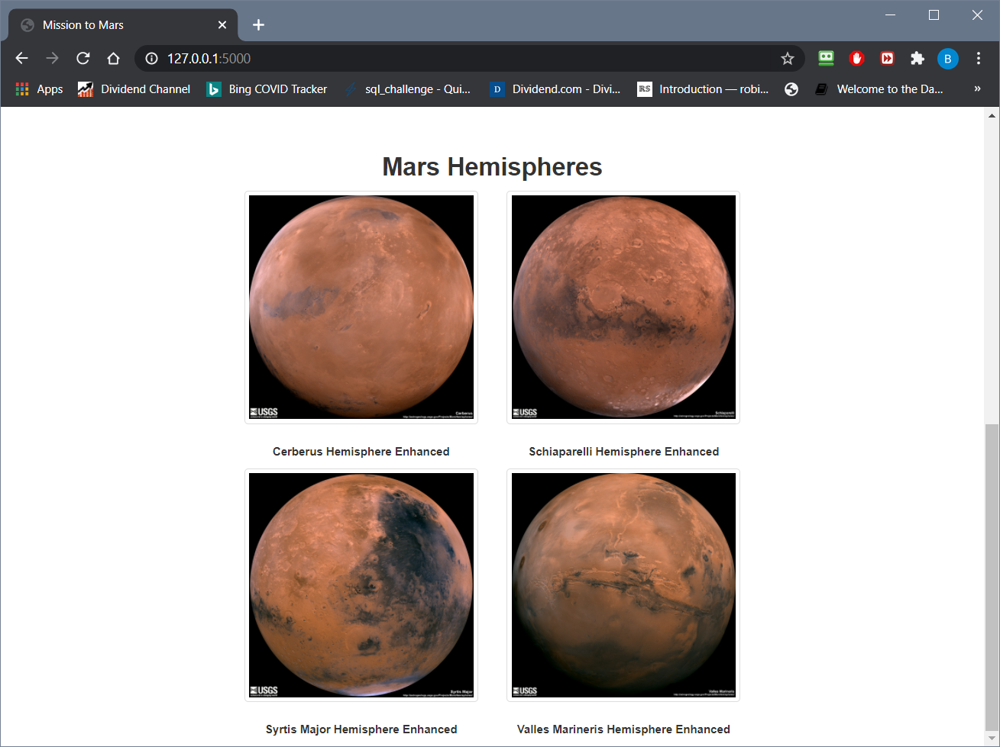

# Web Scraping Homework - Mission to Mars

 
# Background
[Project Details](project_instructions_README.md)

# Overview
Mission to Mars is a flask web application that scrapes Mars information from several sources and displays the information on an html page.

# Web Scrapping

## NASA Mars News
The most current Mars News title and description are scrapped from [NASA Mars News Site](https://mars.nasa.gov/news/).

## JPL Mars Space Images - Featured Image
The featured image is scrapped from  [JPL Featured Space Image](https://www.jpl.nasa.gov/spaceimages/?search=&category=Mars).

## Mars Facts
The table of Mars facts is scrapped from [Mars Facts](https://space-facts.com/mars/).

## Mars Hemispheres
The titles and images of Mars Hemispheres are scrapped from [USGS Astrogeology](https://astrogeology.usgs.gov/search/results?q=hemisphere+enhanced&k1=target&v1=Mars).

# Data Presentation
A flask application (app.py) takes the above scrapped data and outputs the information.  Additionaly a button is provided to perform the scrapping process again.

This application can be run by executing 'python app.py' and then clicking on the http://127.0.0.1:5000/ link that appears.

The following are screen shots of this application

